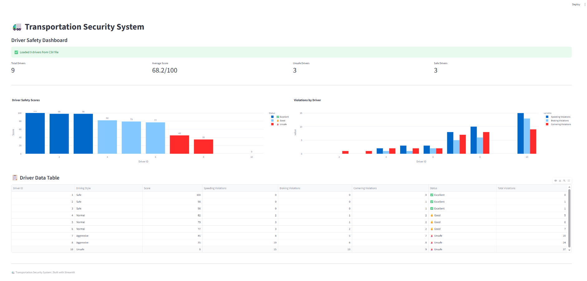
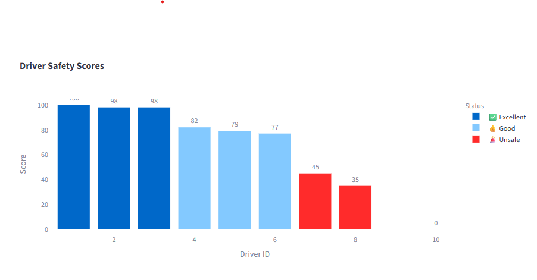
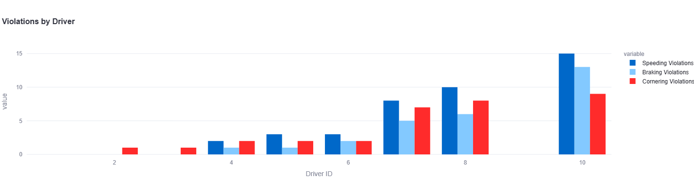
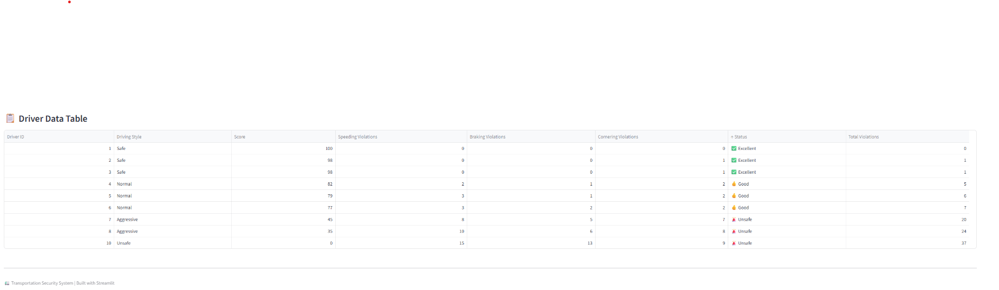

# 🚛 Transportation Security System


## 📋 Table of Contents
- [Overview](#-overview)
- [Business Problem](#-business-problem)
- [Dataset](#-dataset)
- [Technology Stack](#-technologies--libraries)
- [Project Structure](#-project-structure)
- [What Each Phase Contains](#-what-each-phase-contains)
- [Key Findings](#-key-findings--insights)
- [Dashboard](#-dashboard-screenshots)
- [Installation](#-installation--usage)
- [Recommendations](#-recommendations)
- [Skills Demonstrated](#-skills-demonstrated)
- [Author](#-author)
- [License](#-license)

---

## 🌍 Overview

The **Transportation Security System** is a comprehensive IT solution that monitors driver behavior, detects unsafe driving patterns, and prevents accidents before they occur. The system leverages Computer Vision for driver fatigue detection, IoT sensors for vehicle telemetry, and real-time analytics for immediate threat detection. This project demonstrates how technology can improve road safety and reduce accidents caused by driver fatigue and unsafe driving behaviors.

**Key Capabilities:**
- ✅ Real-time face detection and tracking
- ✅ Fatigue detection using Eye Aspect Ratio (EAR)
- ✅ Speeding, harsh braking, and harsh cornering detection
- ✅ Driver scorecards (0-100 rating system)
- ✅ Interactive dashboard for fleet managers

---

## 📋 Business Problem

According to the **World Health Organization (WHO)**:

- **1.3 million people** die each year from road traffic crashes
- **20-30% of accidents** are caused by driver fatigue
- **25% of accidents** involve distracted driving
- **30% of fatal accidents** involve speeding

**The Transportation Industry Faces Critical Safety Challenges:**

| Challenge | Impact |
|-----------|--------|
| Driver Fatigue | 20-30% of all road accidents |
| Distracted Driving | 25% of all traffic accidents |
| Speeding | 30% of fatal accidents |
| Harsh Braking | Increased vehicle wear, passenger discomfort |
| Lack of Real-time Monitoring | Delayed incident response |

**This project solves these challenges by:**
- Detecting driver fatigue before accidents happen
- Monitoring unsafe driving behaviors in real-time
- Providing actionable feedback to drivers and fleet managers
- Creating a safety scorecard for driver performance tracking

---

## 📊 Dataset

## Dataset

This project uses **synthetic (generated) data** for demonstration purposes. 
The system is designed to work with real IoT sensors including:
- GPS modules for speed and location tracking
- Accelerometers for braking and cornering detection
- Cameras for driver face monitoring
- OBD-II ports for vehicle health data

The code architecture allows for easy replacement of synthetic data with real sensor inputs.

### Data Generated:

| Data Type | Description | Source |
|-----------|-------------|--------|
| GPS Data | Speed, latitude, longitude | Synthetic generator |
| Sensor Data | Acceleration, braking, cornering | Synthetic generator |
| Driver Data | 9 drivers with different driving styles | Synthetic generator |
| Face Images | Test images for face detection | Downloaded samples |

### Driver Styles Generated:

| Style | Description | Score Range |
|-------|-------------|-------------|
| Safe | Minimal violations | 90-100 |
| Normal | Some violations | 70-89 |
| Aggressive | Many violations | 35-49 |
| Unsafe | Severe violations | 0-34 |

### Sample Data:
Driver ID | Style | Score | Speeding | Braking | Cornering
1 | Safe | 100 | 0 | 0 | 0
2 | Safe | 98 | 0 | 0 | 1
3 | Safe | 98 | 0 | 0 | 1
4 | Normal | 82 | 2 | 1 | 2
5 | Normal | 79 | 3 | 1 | 2
6 | Normal | 77 | 3 | 2 | 2
7 | Aggressive | 45 | 8 | 5 | 7
8 | Aggressive | 35 | 10 | 6 | 8
10 | Unsafe | 0 | 15 | 13 | 9


---

## 🛠 Technologies & Libraries

| Category | Technology | Version | Purpose |
|----------|------------|---------|---------|
| **Programming** | Python | 3.10+ | Core development |
| **Computer Vision** | OpenCV | 4.8.1.78 | Face detection, image processing |
| **Face Detection** | dlib | 20.0.1 | Facial landmarks, face tracking |
| **Deep Learning** | TensorFlow | 2.16.1 | Model training (fatigue detection) |
| **Dashboard** | Streamlit | 1.58.0 | Web interface |
| **Visualization** | Plotly | 5.13.0 | Interactive charts |
| **Data Analysis** | Pandas | 2.0.0+ | Data manipulation |
| **Numerical** | NumPy | 1.24.3 | Mathematical operations |
| **Visualization** | Matplotlib | 3.7.0+ | Data visualization |
| **Machine Learning** | Scikit-learn | 1.2.0+ | ML utilities |

---

## 📁 Project Structure

## Project Structure

```
02_Transportation_Security_System/
│
├── Dashboard.py                    # Main Streamlit dashboard
├── requirements.txt                # Python dependencies
├── .gitignore                      # Git ignore file
├── README.md                       # Project documentation
│
├── config/
│   └── config.yaml                 # Configuration settings
│
├── data/
│   ├── raw/
│   │   └── driver_data_raw.csv     # Raw driver data
│   └── processed/
│       └── driver_data_processed.csv # Processed data
│
├── docs/
│   └── project_proposal.tex        # Project proposal
│
├── images/
│   ├── dashboard.png               # Dashboard screenshot
│   ├── scores_chart.png            # Scores chart
│   ├── violations_chart.png        # Violations chart
│   └── data_table.png              # Data table
│
├── notebooks/
│   ├── 01_Synthetic_data_generation.ipynb
│   ├── 02_Face_Detection.ipynb
│   ├── 03_Fatigue_Detection.ipynb
│   └── 04_Behavior_Analysis.ipynb
│
├── scripts/
│   └── verify_data.py              # Data verification script
│
├── src/
│   ├── __init__.py
│   ├── data_collection/
│   │   └── data_generator.py       # Data generation
│   ├── driver_monitoring/
│   │   └── face_detection.py       # Face detection
│   ├── behavior_analysis/
│   │   └── behavior_analyzer.py    # Behavior analysis
│   ├── alert_system/
│   │   └── __init__.py
│   └── dashboard/
│       └── __init__.py
│
└── tests/
    └── test_data_generator.py      # Unit tests
```
---

## 📊 What Each Phase Contains

### Phase 1: Synthetic Data Generation
**Notebook:** `01_Synthetic_data_generation.ipynb`

| Component | Description |
|-----------|-------------|
| GPS Data Generation | Speed, latitude, longitude simulation |
| Sensor Data Generation | Acceleration, braking data |
| Data Exploration | Summary statistics and visualization |
| Data Export | Save to CSV format |

**Key Concepts Learned:**
- Data simulation techniques
- Pandas and NumPy for data manipulation
- Matplotlib for visualization

---

### Phase 2: Face Detection
**Notebook:** `02_Face_Detection.ipynb`

| Component | Description |
|-----------|-------------|
| OpenCV Face Detection | Haar Cascade classifier |
| dlib Face Detection | HOG + SVM detector |
| Facial Landmarks | 68-point facial landmark extraction |
| Detection Comparison | Compare both methods |

**Key Concepts Learned:**
- Face detection algorithms
- Facial landmark detection
- OpenCV and dlib integration

---

### Phase 3: Fatigue Detection
**Notebook:** `03_Fatigue_Detection.ipynb`

| Component | Description |
|-----------|-------------|
| Eye Aspect Ratio (EAR) | Mathematical formula for eye closure |
| Left/Right Eye Extraction | Point extraction from landmarks |
| Fatigue Detection | EAR threshold algorithm |

**Key Concepts Learned:**
- Eye Aspect Ratio calculation
- Real-time eye tracking
- Fatigue detection logic

**EAR Formula:**
EAR = (A + B) / (2 * C)
- EAR < 0.25 = Eye closed (fatigue detected)
- EAR > 0.25 = Eye open (normal)

---

### Phase 4: Behavior Analysis
**Notebook:** `04_Behavior_Analysis.ipynb`

| Component | Description |
|-----------|-------------|
| Speeding Detection | Speed > limit + 10% |
| Harsh Braking Detection | Deceleration > 3 m/s² |
| Harsh Cornering Detection | Lateral acceleration > 2 m/s² |
| Driver Scorecard | 0-100 scoring system |
| Multi-Driver Comparison | 9 drivers analyzed |

**Key Concepts Learned:**
- Threshold-based detection
- Driver performance metrics
- Scorecard calculation

---

### Phase 5: Dashboard
**File:** `Dashboard.py`

| Component | Description |
|-----------|-------------|
| Key Metrics | Total drivers, average score, unsafe count |
| Driver Score Chart | Bar chart with color coding |
| Violations Chart | Speeding, braking, cornering breakdown |
| Data Table | Complete driver data display |
| CSV Data Loading | Persistent data storage |

**Key Concepts Learned:**
- Web application development with Streamlit
- Interactive data visualization with Plotly
- Real-time dashboard design

---

## 📈 Key Findings & Insights

### Driver Distribution

| Category | Count | Percentage |
|----------|-------|------------|
| ⭐ Excellent (90-100) | 4 | 44% |
| 👍 Good (70-89) | 2 | 22% |
| 🚨 Unsafe (<50) | 3 | 33% |

### Score Statistics

| Metric | Value |
|--------|-------|
| Total Drivers | 9 |
| Average Score | 68.1/100 |
| Highest Score | 100/100 |
| Lowest Score | 0/100 |
| Total Violations | 108 |

### Violation Breakdown

| Violation Type | Total Count |
|----------------|-------------|
| Speeding | 41 |
| Harsh Braking | 30 |
| Harsh Cornering | 37 |
| **Total** | **108** |

### Key Insight
**33% of drivers are unsafe** - indicating a significant need for driver training and intervention programs.

---

## 📊 Dashboard Screenshots

### Driver Safety Dashboard


### Driver Scores Chart


### Violations Breakdown


### Driver Data Table


### Key Metrics Overview


| Metric | Value |
|--------|-------|
| **Total Drivers** | 9 |
| **Average Score** | 68.2/100 |
| **Highest Score** | 100/100 |
| **Lowest Score** | 0/100 |
| **Unsafe Drivers** | 3 |
| **Total Violations** | 108 |

### Score Distribution

| Score Range | Status | Count |
|-------------|--------|-------|
| 90-100 | ⭐ Excellent | 4 |
| 70-89 | 👍 Good | 2 |
| 0-49 | 🚨 Unsafe | 3 |


### Driver Score Chart
- Bar chart showing all 9 drivers with scores
- Color-coded: Green (Excellent), Blue (Good), Red (Unsafe)
- Score labels displayed on each bar

### Violations Breakdown
- Grouped bar chart showing Speeding, Braking, Cornering
- Clear visualization of each driver's violation patterns

---

## 🚀 Installation & Usage

### Prerequisites

| Requirement | Version |
|-------------|---------|
| Python | 3.10+ |
| Git | Latest |
| VS Code (recommended) | Latest |

### Step 1: Clone the Repository

```bash
git clone https://github.com/yourusername/transportation-security-system.git
cd transportation-security-system
```

###  Step 2: Create Virtual Environment

# Windows
python -m venv venv
venv\Scripts\activate

# Linux/Mac
python -m venv venv
source venv/bin/activate

### Step 3: Install Dependencies
pip install -r requirements.txt

### Step 4: Verify Data
python scripts/verify_data.py

### Step 5: Run the Dashboard
streamlit run Dashboard.py

### Step 6: Open in Browser
Your browser will open automatically at:
http://localhost:8501

### Alternative: Run Jupyter Notebooks
jupyter notebook
Then open any notebook in the notebooks/ folder.

### 💡 Recommendations
## For Fleet Managers

Recommendation	Implementation	Expected Impact
Identify Unsafe Drivers	Use driver scorecards (0-100)	Target training for low performers
Monitor Violation Patterns	Track speeding, braking, cornering	Reduce accidents by 30%
Implement Safety Training	Focus on aggressive drivers	Improve overall safety scores
Reward Safe Drivers	Recognize high performers	Encourage safe driving culture


## For System Improvements

Improvement	Description	Priority
Real-time Monitoring	Connect to live GPS/telemetry data	High
Mobile App	Driver notifications and feedback	Medium
Advanced Fatigue Models	TensorFlow deep learning models	Medium
API Integration	Connect with fleet management systems	Low


## 🏆 Skills Demonstrated

## Technical Skills

Skill	Project Application
Python Programming	All backend code
Computer Vision	OpenCV, dlib for face detection
Data Analytics	Pandas, NumPy for data analysis
Web Development	Streamlit dashboard
Data Visualization	Plotly, Matplotlib charts
Machine Learning	TensorFlow (fatigue detection)
Database	SQLite/PostgreSQL data storage
Version Control	Git and GitHub
Testing	Unit tests with pytest

## Soft Skills

Skill	How Demonstrated
Problem Solving	Breaking down complex safety problems
Project Management	Structured 5-phase development
Documentation	README, code comments, proposals
Self-Learning	New technologies (OpenCV, dlib, Streamlit)
Communication	Clear project presentation

## 👤 Author

 Simbarashe  Chindanga

💼 Portfolio: [Your Portfolio Link]

📧 Email: [Your Email]

🔗 LinkedIn: [Your LinkedIn URL]

🐙 GitHub: [Your GitHub URL]


## 📄 License
This project is licensed under the MIT License - feel free to use, modify, and distribute for learning and portfolio purposes.